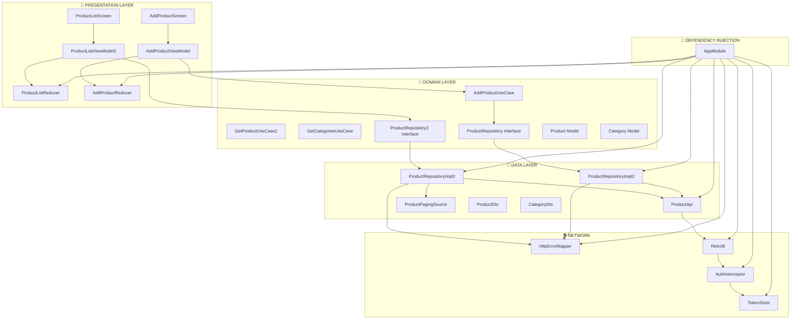
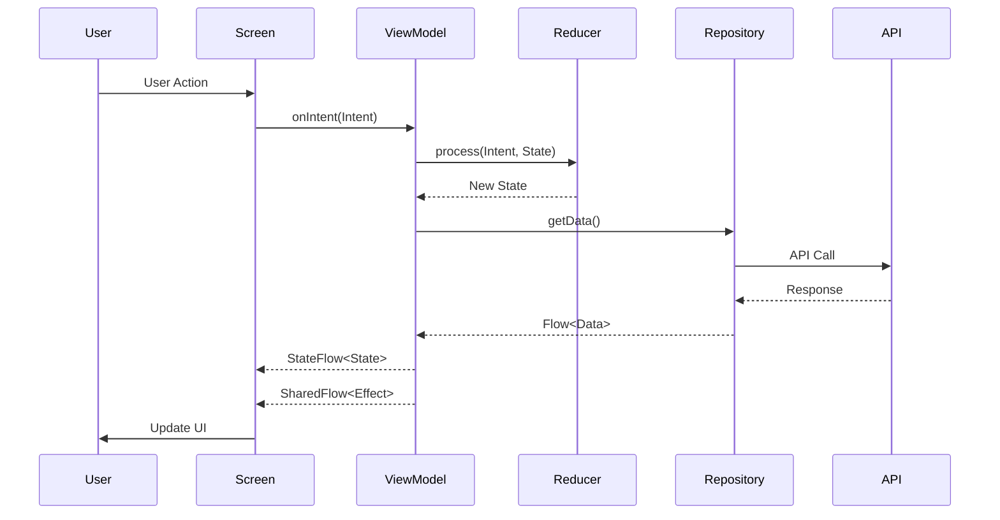
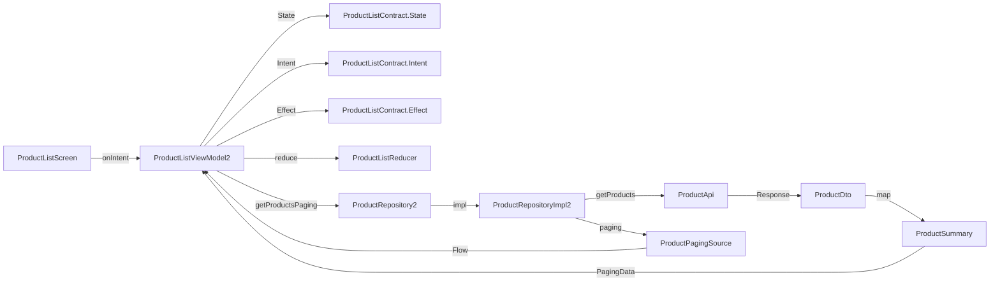
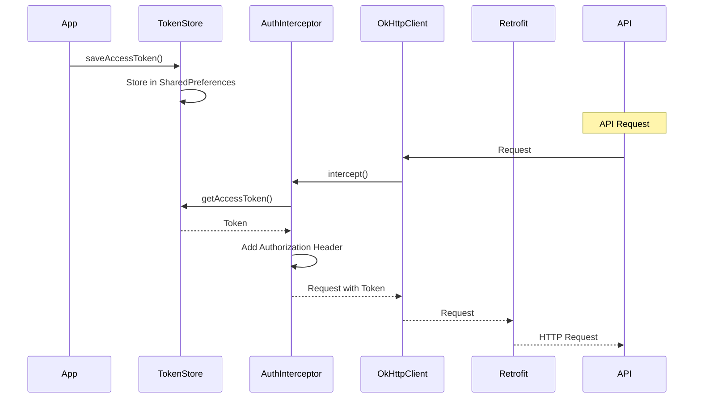
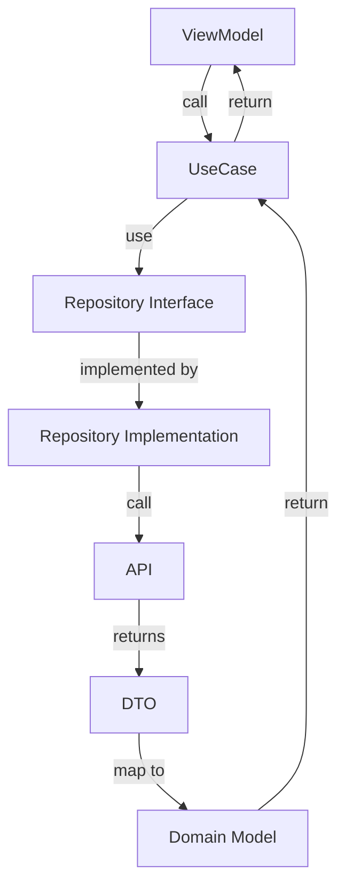

```mermaid
graph TD
    A[com.tayyipgunay.firststajproject] --> B[App.kt]
    A --> C[MainActivity.kt]
    A --> D[domain]
    A --> E[data]
    A --> F[presentation]
    A --> G[core]
    A --> H[di]
    
    D --> D1[model]
    D --> D2[repository]
    D --> D3[usecase]
    
    D1 --> D1A[Product.kt]
    D1 --> D1B[ProductSummary.kt]
    D1 --> D1C[Category.kt]
    D1 --> D1D[ModelTypeUi.kt]
    
    D2 --> D2A[ProductRepository.kt]
    D2 --> D2B[ProductRepository2.kt]
    
    D3 --> D3A[GetProductUseCase2.kt]
    D3 --> D3B[GetCategoriesUseCase.kt]
    D3 --> D3C[AddProductUseCase.kt]
    
    E --> E1[auth]
    E --> E2[network]
    E --> E3[paging]
    E --> E4[remote]
    E --> E5[repository]
    
    E1 --> E1A[TokenStore.kt]
    E2 --> E2A[AuthInterceptor.kt]
    E2 --> E2B[HttpErrorMapper.kt]
    E3 --> E3A[ProductPagingSource.kt]
    E3 --> E3B[PagingConstants.kt]
    E4 --> E4A[ProductApi.kt]
    E4 --> E4B[dto]
    E4B --> E4B1[ProductDto.kt]
    E4B --> E4B2[CategoryDto.kt]
    E5 --> E5A[ProductRepositoryImpl.kt]
    E5 --> E5B[ProductRepositoryImpl2.kt]
    
    F --> F1[products]
    F --> F2[add]
    F --> F3[common]
    F --> F4[ui]
    
    F1 --> F1A[list]
    F1A --> F1A1[ProductListScreen.kt]
    F1A --> F1A2[ProductListViewModel2.kt]
    F1A --> F1A3[ProductListContract.kt]
    F1A --> F1A4[ProductListReducer.kt]
    F1A --> F1A5[ProductSort.kt]
    
    F2 --> F2A[AddProductScreen.kt]
    F2 --> F2B[AddProductViewModel.kt]
    F2 --> F2C[AddProductContract.kt]
    F2 --> F2D[AddProductReducer.kt]
    
    F3 --> F3A[ConfirmId.kt]
    F3 --> F3B[events]
    F3B --> F3B1[MessageType.kt]
    
    F4 --> F4A[components]
    F4 --> F4B[state]
    F4 --> F4C[theme]
    F4A --> F4A1[Badges.kt]
    F4A --> F4A2[Chips.kt]
    F4B --> F4B1[States.kt]
    F4C --> F4C1[Theme.kt]
    F4C --> F4C2[Color.kt]
    F4C --> F4C3[Type.kt]
    
    G --> G1[error]
    G --> G2[mvi]
    G --> G3[util]
    
    G1 --> G1A[AppError.kt]
    G1 --> G1B[AppException.kt]
    G1 --> G1C[ProblemJson.kt]
    G1 --> G1D[ThrowableMapping.kt]
    G1 --> G1E[UserFacingMessage.kt]
    
    G2 --> G2A[MVIComponent.kt]
    
    G3 --> G3A[Constants.kt]
    G3 --> G3B[Resource.kt]
    G3 --> G3C[MultipartUtils.kt]
    G3 --> G3D[RequestBodies.kt]
    
    H --> H1[AppModule.kt]
```

# Proje Yapısı Görsel Diyagramı

## 📐 Paket Yapısı Ağaç Diyagramı

## 🏗️ Mimari Katman İlişkileri

## 🔄 MVI Pattern Akış Diyagramı

## 📊 Product List Feature Detaylı Akış

## 🔐 Authentication Flow

## 🎯 Use Case Pattern

